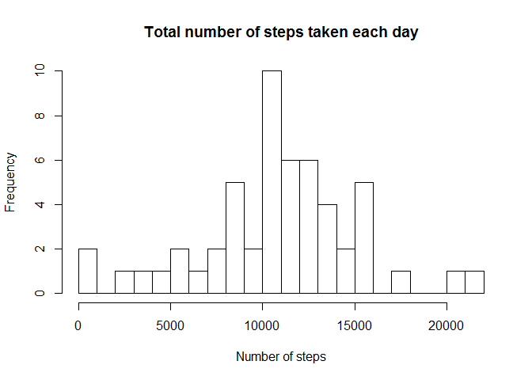

# Reproducible Research: Peer Assessment 1
Dominik Koch  
Sunday, July 19, 2015  

### General preparation

At the beginning of the code all required R Packages are loaded. The working
directory is needed for creating the data folder. And the seed is set for 
reproducibility.


```r
# Import packages
library(knitr)
library(caret)
library(dplyr)

# Working directory
wd <- getwd()

# Reproducibility
set.seed(42)
```

### Download data

Download the zip file in the data folder and extract it. If there is no *data* folder yet, it
will be created. The data will only be downloaded and unzipped once.


```r
# Data source (19.07.2015)
url <- "http://d396qusza40orc.cloudfront.net/repdata%2Fdata%2Factivity.zip"

# Create folder
if(!file.exists(file.path(wd,"data"))){
  dir.create(file.path(wd,"data"))
}

# Download zipped file
if(!file.exists(file.path(wd,"data","data.zip"))){ 
  download.file(url, file.path(wd,"data","data.zip")) 
}

# Extract files from data.zip
if(!file.exists(file.path(wd,"data","activity.csv"))){ 
  unzip(file.path(wd,"data","data.zip"), exdir = file.path(wd,"data"))
}

# Check data
list.files(file.path(wd,"data"))
```

```
## [1] "activity.csv" "data.zip"
```

### Tasks

## 01: Loading and preprocessing the data

In the next step the csv files will be imported


```r
# Load data
data <- read.csv("data/activity.csv", stringsAsFactors=FALSE)

# Check data
dim(data)
```

```
## [1] 17568     3
```

```r
str(data)
```

```
## 'data.frame':	17568 obs. of  3 variables:
##  $ steps   : int  NA NA NA NA NA NA NA NA NA NA ...
##  $ date    : chr  "2012-10-01" "2012-10-01" "2012-10-01" "2012-10-01" ...
##  $ interval: int  0 5 10 15 20 25 30 35 40 45 ...
```

```r
summary(data)
```

```
##      steps            date              interval     
##  Min.   :  0.00   Length:17568       Min.   :   0.0  
##  1st Qu.:  0.00   Class :character   1st Qu.: 588.8  
##  Median :  0.00   Mode  :character   Median :1177.5  
##  Mean   : 37.38                      Mean   :1177.5  
##  3rd Qu.: 12.00                      3rd Qu.:1766.2  
##  Max.   :806.00                      Max.   :2355.0  
##  NA's   :2304
```

The data set consists of 17568 observations and 3 
variables. 

Definition of the variables:

- **steps**: Number of steps taking in a 5-minute interval 
- **date**: The date on which the measurement was taken in YYYY-MM-DD format
- **interval**: Identifier for the 5-minute interval in which measurement was taken

In the following code block the class of the date variable is changed an a new
timestamp variable is created.


```r
data$date <- as.Date(data$date)

addZeros <- function(x){
  paste0("000", x, "00")
}

substrRight <- function(x, n){
  substr(x, nchar(x)-n+1, nchar(x))
}

addColon <- function(x){
  paste0(substr(x, 1, 2),":",substr(x, 3, 4),":",substr(x, 5, 6))
}

data$chron <- as.POSIXct(strptime(paste(data$date,addColon(substrRight(addZeros(data$interval), 6))), "%Y-%m-%d %H:%M:%S"))

# Check data
summary(data)
```

```
##      steps             date               interval     
##  Min.   :  0.00   Min.   :2012-10-01   Min.   :   0.0  
##  1st Qu.:  0.00   1st Qu.:2012-10-16   1st Qu.: 588.8  
##  Median :  0.00   Median :2012-10-31   Median :1177.5  
##  Mean   : 37.38   Mean   :2012-10-31   Mean   :1177.5  
##  3rd Qu.: 12.00   3rd Qu.:2012-11-15   3rd Qu.:1766.2  
##  Max.   :806.00   Max.   :2012-11-30   Max.   :2355.0  
##  NA's   :2304                                          
##      chron                    
##  Min.   :2012-10-01 00:00:00  
##  1st Qu.:2012-10-16 05:58:45  
##  Median :2012-10-31 11:57:30  
##  Mean   :2012-10-31 11:30:49  
##  3rd Qu.:2012-11-15 17:56:15  
##  Max.   :2012-11-30 23:55:00  
## 
```


## 02: What is mean total number of steps taken per day?

Note: missing values can be ignored

- Make a histogram of the total number of steps taken each day

The data has to be grouped by day in order to add all steps of the day together.


```r
data.total <- data[,c("steps","date")] %>%
  group_by(date) %>%
  summarise(total_steps_day = sum(steps))
```


```r
hist(data.total$total_steps_day, 25,
     main = "Total number of steps taken each day",
     xlab = "Number of steps",
     ylab = "Frequency")
```

 

- Calculate and report the mean and median total number of steps taken per day


```r
summary(data.total$total_steps_day, digits = 5)
```

```
##    Min. 1st Qu.  Median    Mean 3rd Qu.    Max.    NA's 
##      41    8841   10765   10766   13294   21194       8
```

The mean 10766.19 is only slightly larger than the median 10765

## 03: What is the average daily activity pattern?

- Make a time series plot of the 5-minute interval and the average number of steps taken, averaged across all days 

Calculate the average number of steps across all days.


```r
data.avg <- data[,c("steps","interval")] %>%
  group_by(interval) %>%
  summarise(avg_steps = mean(steps, na.rm = TRUE))

data.avg$chron <- (addColon(substrRight(addZeros(data.avg$interval), 6)))
```


```r
data.avg$test <- as.POSIXct(strptime(data.avg$chron, "%H:%M:%S"))
plot(data.avg$test, data.avg$avg_steps, type = "l",
     main = "average number of steps taken across all days",
     xlab = "time",
     ylab = "number of steps")
```

 

- Which 5-minute interval, on average across all the days in the dataset, contains the maximum number of steps?


```r
data.avg[which.max(data.avg$avg_steps),"chron"]
```

```
## Source: local data frame [1 x 1]
## 
##      chron
## 1 08:35:00
```

## 04: Imputing missing values

- Calculate and report the total number of missing values in the dataset


```r
table(complete.cases(data))
```

```
## 
## FALSE  TRUE 
##  2304 15264
```

In total 2304 observations contain missing values.

- Devise a strategy for filling in all of the missing values in the dataset. 

Note: The strategy does not need to be sophisticated. 


```r
table(data[complete.cases(data) == FALSE,"date"])
```

```
## 
## 2012-10-01 2012-10-08 2012-11-01 2012-11-04 2012-11-09 2012-11-10 
##        288        288        288        288        288        288 
## 2012-11-14 2012-11-30 
##        288        288
```

Eight days have no values at all. I'm going to impute these days with the average values
calculated in task 03.


- Create a new dataset that is equal to the original dataset but with the missing data filled in.


```r
data.imp <- merge(data, data.avg[,1:2], by = "interval")
data.imp <- data.imp %>% 
  arrange(chron) %>%
  mutate(steps = ifelse(is.na(steps),avg_steps,steps))
```

- Make a histogram of the total number of steps taken each day and Calculate and report the mean and median total number of steps taken per day. Do these values differ from the estimates from the first part of the assignment? What is the impact of imputing missing data on the estimates of the total daily number of steps?

The data has to be grouped by day in order to add all steps of the day together.


```r
data.imp_total <- data.imp[,c("steps","date")] %>%
  group_by(date) %>%
  summarise(total_steps_day = sum(steps))

hist(data.imp_total$total_steps_day, 25)
```

 


```r
summary(data.imp_total$total_steps_day, digits = 5)
```

```
##    Min. 1st Qu.  Median    Mean 3rd Qu.    Max. 
##      41    9819   10766   10766   12811   21194
```

The mean 10766.19 remains unchanged but the median 10766.19 has adapted to the median. The reason for this is that we imputed the same value for all eight days because it is very unlikely to measure the dead even value on multiple days.

## 05: Are there differences in activity patterns between weekdays and weekends?

- Create a new factor variable in the dataset with two levels - "weekday" and "weekend" indicating whether a given date is a weekday or weekend day.


```r
data.imp$weekday <- ifelse(weekdays(data.imp$date) %in% c("Samstag","Sonntag"),
                           "weekend","weekday")

table(data.imp$weekday)
```

```
## 
## weekday weekend 
##   12960    4608
```

- Make a panel plot containing a time series plot (i.e. type = "l") of the 5-minute interval (x-axis) and the average number of steps taken, averaged across all weekday days or weekend days (y-axis).


```r
data.imp_aggr <- data.imp %>%
  group_by(weekday, interval) %>%
  summarise(avg_steps = mean(steps))

data.imp_aggr$chron <- (addColon(substrRight(addZeros(data.imp_aggr$interval), 6)))

data.imp_aggr$test <- as.POSIXct(strptime(data.imp_aggr$chron, "%H:%M:%S"))

par(mfrow = c(2, 1))
par(cex = 0.6)
par(mar = c(0, 0, 2, 0), oma = c(4, 4, 0.5, 0.5))
par(tcl = -0.25)
par(mgp = c(2, 0.6, 0))

plot(data.imp_aggr[data.imp_aggr$weekday == "weekday",]$test, 
     data.imp_aggr[data.imp_aggr$weekday == "weekday",]$avg_steps, type = "l",
     main = "average number of steps taken across all weekday days",
     xaxt="n",
     ylim = c(0,250))

data.imp_aggr$test <- as.POSIXct(strptime(data.imp_aggr$chron, "%H:%M:%S"))
plot(data.imp_aggr[data.imp_aggr$weekday == "weekend",]$test, 
     data.imp_aggr[data.imp_aggr$weekday == "weekend",]$avg_steps, type = "l",
     main = "average number of steps taken across all weekend days",
     ylim = c(0,250)
)

mtext("time", side = 1, outer = TRUE, cex = 0.7, line = 2.2, col = "grey20")
mtext("number of steps", side = 2, outer = TRUE, cex = 0.7, line = 2.2, col = "grey20")
```

 
